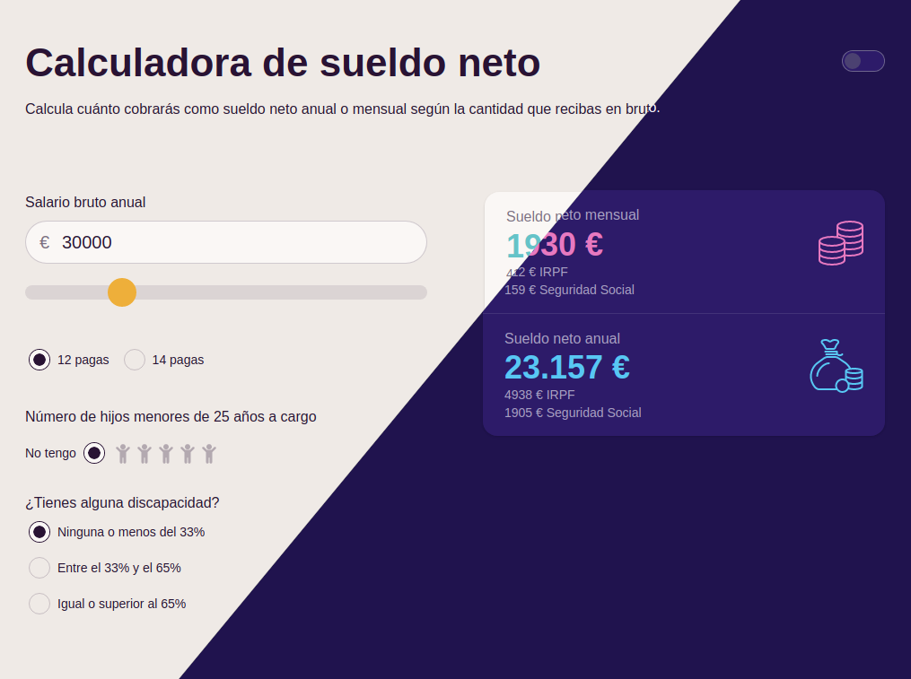
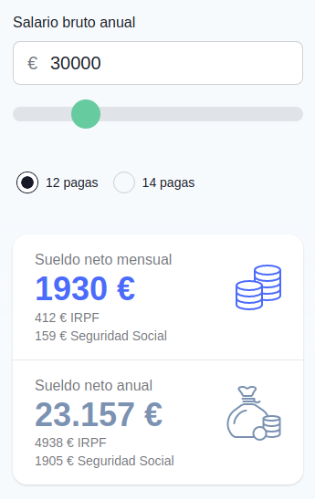

<!-- LOGO -->
<p align="center">
  <a href="https://sueldo.netlify.app">
    
  </a>
</p>

<!-- TITLE -->
<h1 align="center">
  Salary Calculator
</h1>

<!-- BADGES -->
<p align="center">
    <a href="https://app.netlify.com/sites/sueldo/deploys"></a>
</p>

<!-- SUMMARY -->
<p align="center">
Calculate how much you will receive as annual or monthly net salary based on the amount you receive gross <strong>in Spain</strong> 🇪🇸.
<br />
</p>

## 🚀 <a href="https://sueldo.netlify.app">sueldo.netlify.app</a>



## 🖼️ Embed in your website

- As standard view

```html
<iframe
  src="https://sueldo.netlify.app/embed"
  frameborder="none"
  width="750px"
  height="630px"
></iframe>
```

- As minimal view

```html
<iframe
  src="https://sueldo.netlify.app/embed/minimal/"
  frameborder="none"
  width="350px"
  height="550px"
></iframe>
```

### ✨ Config your embedded with several themes:

### Themes

|     | theme     |     | theme     |     | theme     |     | theme     |
| :-- | :-------- | :-- | :-------- | :-- | :-------- | :-- | :-------- |
| 🌝  | light     | 🌚  | dark      | 🧁  | cupcake   | 🐝  | bumblebee |
| ✳️  | emerald   | 🏢  | corporate | 🌃  | synthwave | 🤖  | cyberpunk |
| 🌸  | valentine | 🎃  | halloween | 🌷  | garden    | 🌲  | forest    |
| 🐟  | aqua      | 👓  | lofi      | 🖍   | pastel    | 🧚‍ | ️ fantasy |
| 📝  | wireframe | 🏴  | black     | 💎  | luxury    | 🧛‍ | dracula   |
| 🖨   | cmyk      |

```html
<iframe
  src="https://sueldo.netlify.app/embed/minimal/?theme=emerald"
  frameborder="none"
  width="750px"
  height="630px"
></iframe>
```



## 🏃 Start and run

[🏗️ Technologies 📑 Requirements 🛠️ Environment configuration 🌍 Run Locally ✅ Tests execution](docs/start.md)
